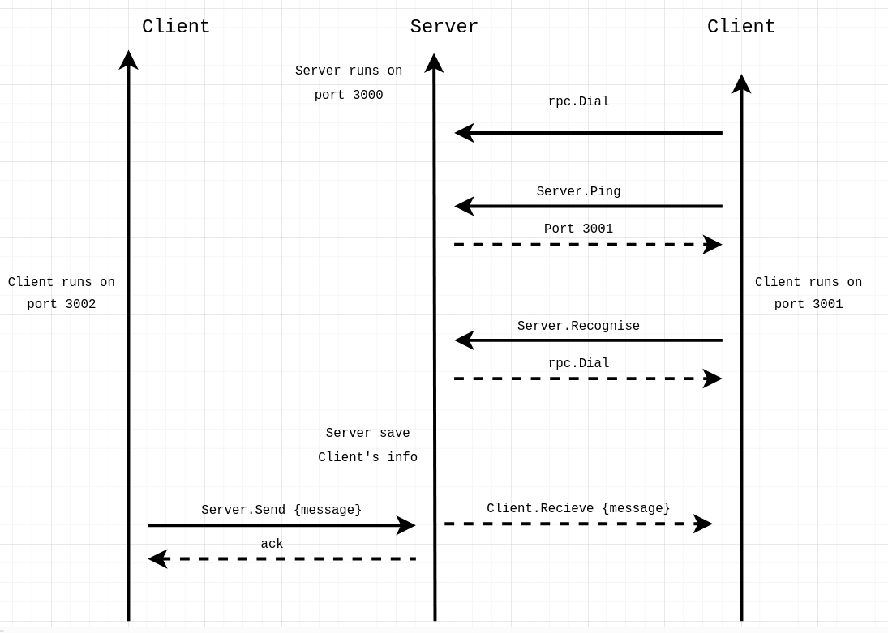

### Event-Driven Chat room using RPC.

Server responsplities: 
    - recognise clients (clients ping the server Server.Ping)
    - assign them ports to run on  (Server.Recognise)
    - recieve messages and forward them (Server.Send)

Client: 
    - ping the server for port
    - runs on that port 
    - recieve messages (Client.Recieve)

### Connection Diagram: 

